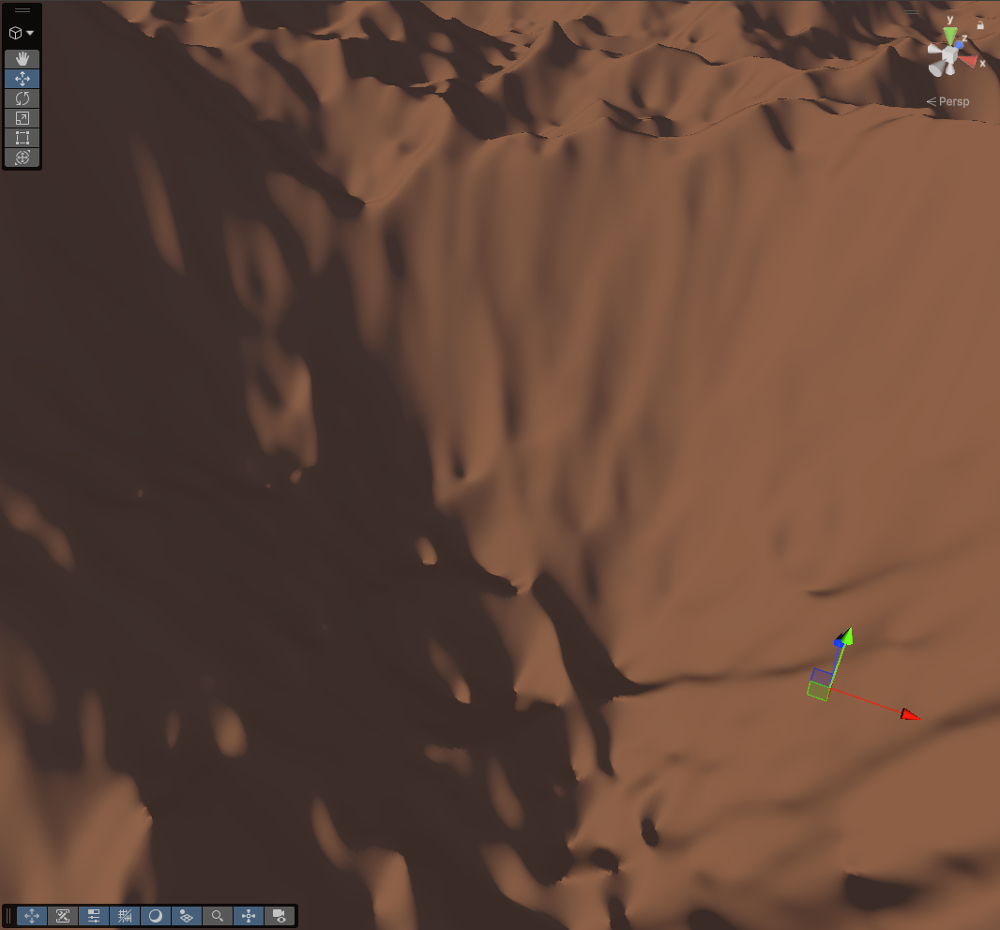
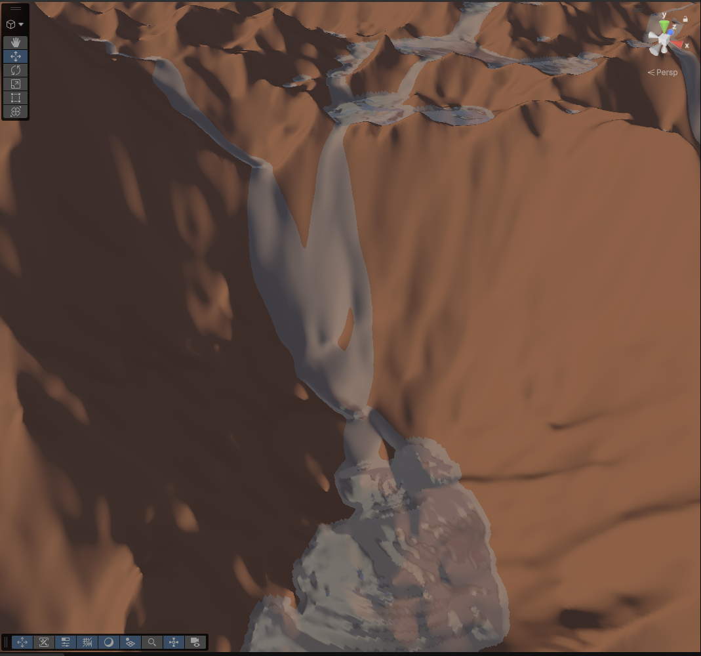
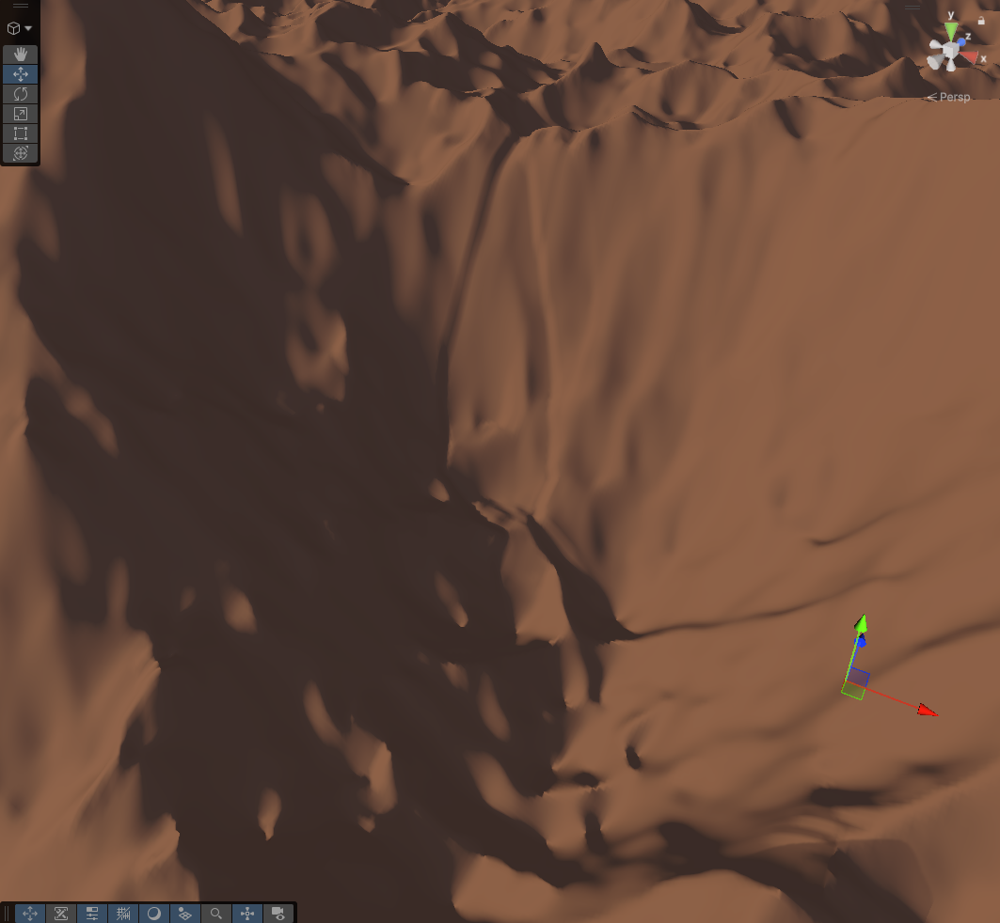

# Grid-Based Hydraulic Erosion Simulation Unity

This is a prototype Unity implementation of a grid-based hydraulic erosion simulation. It is based on the paper [Fast Hydraulic and Thermal Erosion on the GPU](https://old.cescg.org/CESCG-2011/papers/TUBudapest-Jako-Balazs.pdf) by Balázs Jako and László Szirmay-Kalos as will as [Fast Hydraulic Erosion Simulation and Visualization on GPU](https://xing-mei.github.io/files/erosion.pdf) by Xing Mei, Jianwei Guo, and Xinguo Liu.

## Features

- Create initial terrain with Fractal Browian Motion on a compute shader.
- Simulate hydraulic erosion on a compute shader separated in multiple kernels following mainly the second paper mentionned.
- Runs in real time.

## To Do
- Correct some instabilities in the simulation.
- Add thermal erosion.

## Images

| Initial Terrain 	                          | During The Simulation 	                    | After The Simulation                        |
|-----------------                            |----------------------	                    |-----------------------	                  |
|| |  |

# Demo

The demo scene is available in the `Assets/Scenes/ErosionV2.unity` file. The other scene is pretty much deprecated.