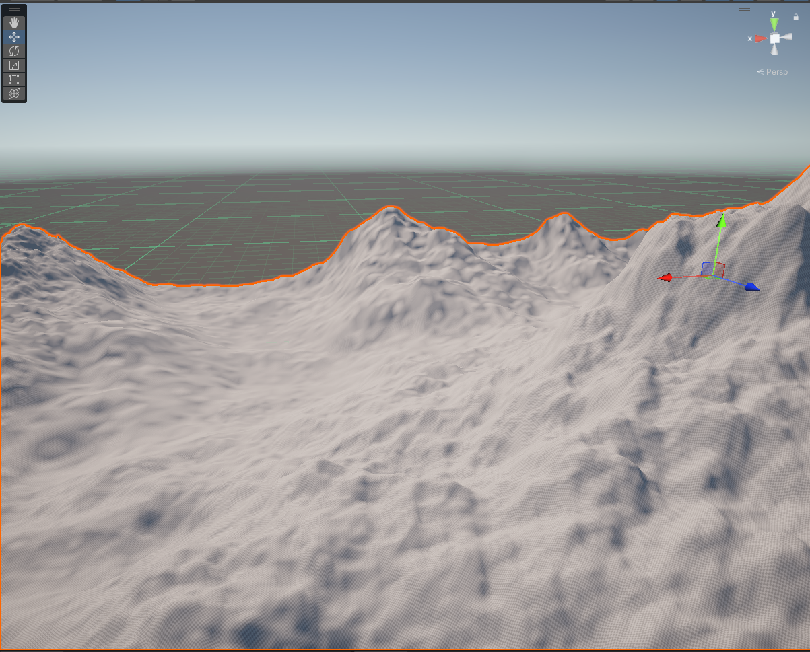
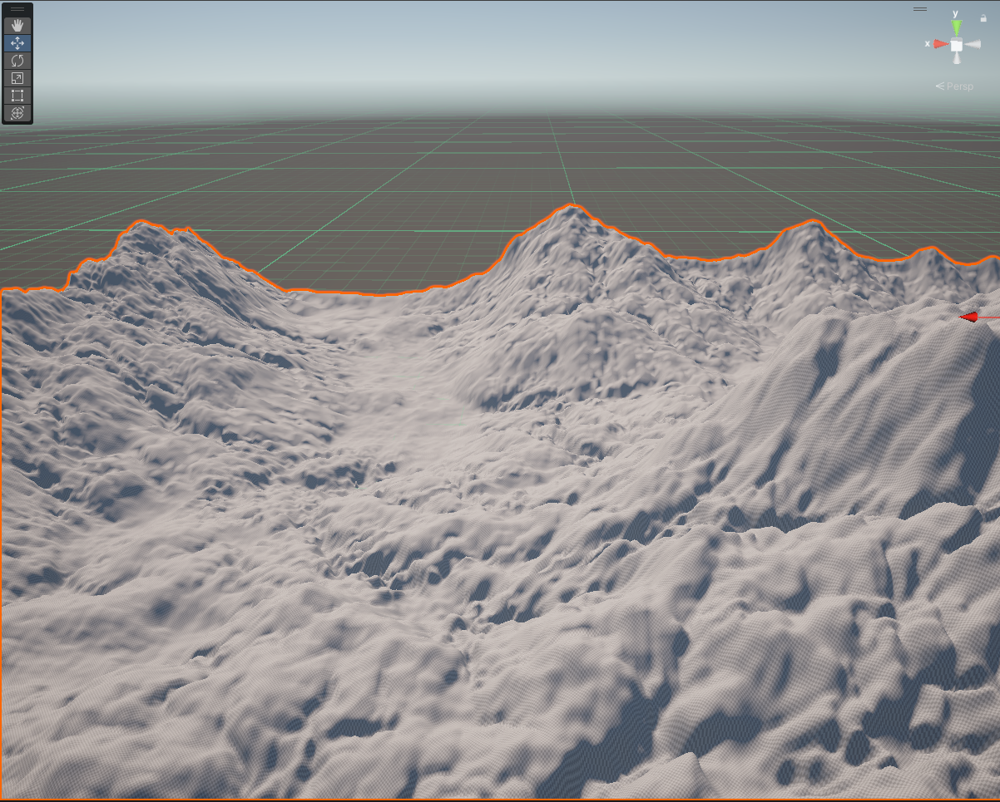

# Grid-Based Hydraulic Erosion Simulation Unity

This is a prototype Unity implementation of a grid-based hydraulic erosion simulation. It is based on the paper [Fast Hydraulic and Thermal Erosion on the GPU](https://old.cescg.org/CESCG-2011/papers/TUBudapest-Jako-Balazs.pdf) by Balázs Jako and László Szirmay-Kalos as will as [Fast Hydraulic Erosion Simulation and Visualization on GPU](https://xing-mei.github.io/files/erosion.pdf) by Xing Mei, Jianwei Guo, and Xinguo Liu.

## Features

- Create initial terrain with Fractal Browian Motion on a compute shader.
- Simulate hydraulic erosion on a compute shader separated in multiple kernels following the paper by Jako and Szirmay-Kalos.
- Runs in the editor as a tool to create terrain.

## To Do
- Make sure that the simulation is correct.
- Make the simulation run in real-time.
- Add thermal erosion.

## Images

| Initial Terrain 	                          | After The Simulation 	                  |
|-----------------                            |----------------------	                  |
|||
